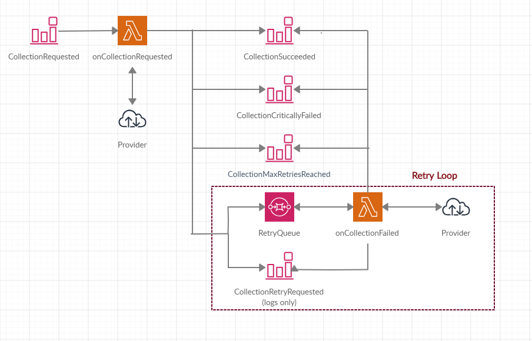

# Demo for Wonderbill

## The Mission
1) A fault-tolerant data collection system with webhook
2) The API should accept a POST with two fields provider (gas or internet) and the callbackUrl.
3) The payload should be validated accordingly;
4) Once payload is accepted, collect the data from the mock endpoint and call the callbackUrl with the collected data;
5) The providers may or may not be available at the time of request
6) Only use tools and frameworks you are familiar with

## Approach

I choose to leverage my extensive AWS/Serverless experience and propose to you a solution that is :
- Fully serverless, 
- asynchronous
- event-driven
- fault-tolerant
- highly scalable
- infra-as-code

### Tech Stack
- TypeScript
- AWS : ApiGateway/Lambda/EventBridge/SQS
- Serverless framework

### Proposal

#### POST endpoint

- The entry point (/collect) is an API Gateway Lambbda integration 
- Validation is done through a JSON schema directly on API Gateway, no invalid payload will reach Lambda (saves execution costs + no-code approach)
- If the Payload is Valid, Lambda emits a `CollectionRequested` event to EventBridge
- The client receives a unique `RequestId` for debugging purposes

### Data Collection

- To reduce latency and costs further, a Lambda directly processes the `CollectionRequested` event and requests the data from the external provider
  - If collection is successful, Lambda emits a `CollectionSuccessful` event
  - If we catch an internal error we avoid retrying as it is more than likely the fault is on our side.
    Lambda emits a `CollectionCriticallyFailed` event which will have to be reviewed by the tech team
  - If it looks like an external server Error, we place a `CollectionRetryRequested` message in a queue, with a `DelaySeconds` property calculated using the exponential backoff algorithm (with a maximum of 15 minutes between retries). We also send the event to the bridge for logging purposes (optional).
  - If we reach the `maxRetries` parameter, we emit a `CollectionCriticallyFailed` event which will have to be reviewed by the tech team
  
#### Data collection retry
- The handler is essentially the same than `onCollectionRequested`, with the following differences
  - Source event comes from SQS and has been delayed according to our backoff params
  
#### Design Choices
- Exponential backoff
  - It is "polite" to backoff when an external server doesn't reply, and saves us the compute time of constantly retrying
  - The backoff parameters are modifiable in config
  - The hard limit of 900seconds for SQS delay doesn't feel like a problem to handle, but open to discussion, the `CollectionMaxRetriesReached` event can be handled in many ways if required (EventBridge allows scheduled events, we could run a task to re-retry every hour ).
  
- SQS vs Step Functions :
We could have used a state machine to run the retry function, as it offers integrated exponential backoff retries, however :
  - Step Functions are very costly
  - Our workflow isn't complex enough
  
#### Implementation steps 

I've broken down the work to be done into stories (for easy PRs) :
- [DEMO-001 Setup project and "providers" endpoints](https://github.com/xShirase/webhook_demo/pull/1)
- [DEMO-002 Configure serverless.yml and build project tree](https://github.com/xShirase/webhook_demo/pull/2)
- [DEMO-003 Request Collection endpoint](https://github.com/xShirase/webhook_demo/pull/3)
- [DEMO-004 onCollectionRequested endpoint](https://github.com/xShirase/webhook_demo/pull/4)
- [DEMO-005 Retry mechanism (onCollectionFailed)](https://github.com/xShirase/webhook_demo/pull/5)
- [DEMO-006 onCollectionSucceeded endpoint](https://github.com/xShirase/webhook_demo/pull/6)

#### Further Work
- TODO hunting
- add types 
- add handler tests